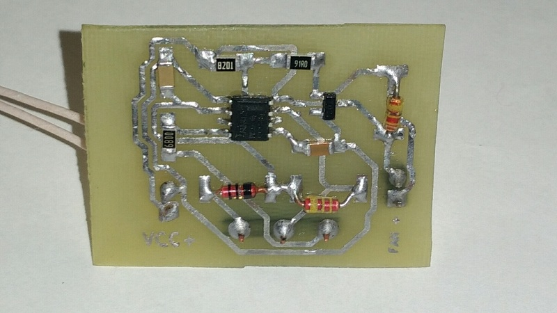

# Регулятор оборотов венитилятора

Основан на схеме из статьи [«ШИМ регулятор на таймере NE555»](http://easyelectronics.ru/shim-regulyator-na-tajmere-ne555.html).

Схема спроектирована в САПР KiCAD.

Компоненты:

- Таймер NE555 в корпусе SOIC-8.
- Транзистор 2N7002.
- Резистор на 91 Ω.
- Резистор на 8200 Ω.
- Резистор на 680 Ω.
- Конденсатор на 1 нФ.
- Конденсатор на 2.2 нФ.
- Диод × 3 — любые маломощные.

Все SMD-компоненты размера 1206. Диоды выводные, но использован поверхностный монтаж.

Схема подключается к:

- источнику питания (12 В, можно меньше),
- вентилятору (хорошо работает с вентилятором от блока питания),
- переменному резистору на 5—50 kΩ (средний вывод — бегунок).

Ни один компонент не должен греться во время работы. Частоты ультразвукове, поэтому ШИМ-регулятор не должен быть слышен. Если брать потенциометр с большим сопротивлением, возможно, придётся уменьшить ёмкость C1 для повышения частоты.

## Пути улучшения

Схему можно сделать намного более компактной, разместив компоненты ближе друг к другу и использовав размер 0805.

## Фото собранной схемы

